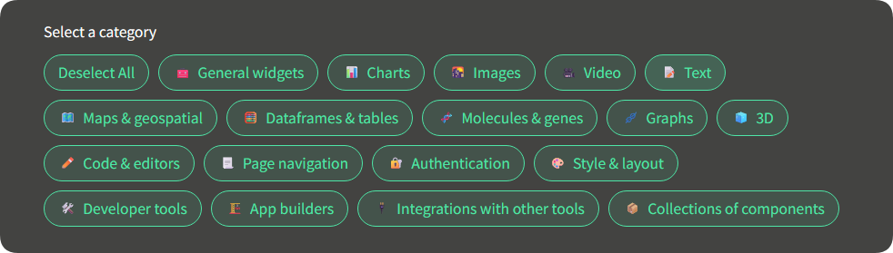

### WIP: do try this at home, but not in production!

> [!IMPORTANT]  
> This was forked from jrieke's streamlit-pills.
> Streamlit already includes this functionality via `st.pills` (see [docs](https://docs.streamlit.io/develop/api-reference/widgets/st.pills)), but this component adds a Select All button — that’s the key difference.

# streamlit-capsules 💊

**A Streamlit component to show clickable capsules/pills.**

This custom component works just like `st.pills` but shows the option to select all
capsules. It's nice to show the user upfront that they can select all options,
without needing to click each and every option.

---

<h3 align="center">
  💊 <a href="https://capsules-component.streamlit.app/">Demo app</a> 💊
</h3>

---

<p align="center">
    <a href="https://capsules-component.streamlit.app/"></a>
</p>


## Installation

```bash
pip install streamlit-capsules
```

## Usage

```python
from streamlit_capsules import capsules

selected = capsules("Label", ["Option 1", "Option 2", "Option 3"], ["🍀", "🎈", "🌈"])
st.write(selected)
```

See [the demo app](https://capsules-component.streamlit.app/) for a detailed guide!


## Development

Note: you only need to run these steps if you want to change this component or 
contribute to its development!

### Setup

First, clone the repository:

```bash
git clone https://github.com/gRodrigues03/streamlit-capsules.git
cd streamlit-capsules
```

Install the Python dependencies:

```bash
poetry install
```

And install the frontend dependencies:

```bash
cd streamlit_capsules/frontend
npm install
```

### Making changes

To make changes, first go to `streamlit_capsules/__init__.py` and make sure the 
variable `_RELEASE` is set to `False`. This will make the component use the local 
version of the frontend code, and not the built project. 

Then, start one terminal and run:

```bash
cd streamlit_capsules/frontend
npm start
```

This starts the frontend code on port 3001.

Open another terminal and run:

```bash
cp demo/streamlit_app.py .
poetry shell
streamlit run streamlit_app.py
```

This copies the demo app to the root dir (so you have something to work with and see 
your changes!) and then starts it. Now you can make changes to the Python or Javascript 
code in `streamlit_capsules` and the demo app should update automatically!

If nothing updates, make sure the variable `_RELEASE` in `streamlit_capsules/__init__.py` is set to `False`. 


### Publishing on PyPI

Switch the variable `_RELEASE` in `streamlit_capsules/__init__.py` to `True`. 
Increment the version number in `pyproject.toml`. Make sure the copy of the demo app in 
the root dir is deleted or merged back into the demo app in `demo/streamlit_app.py`.

Build the frontend code with:

```bash
cd streamlit_capsules/frontend
npm run build
```

After this has finished, build and upload the package to PyPI:

```bash
cd ../..
poetry build
poetry publish
```

## Changelog

### 0.3.0 (November 22, 2022)
- Added `label_visibility` parameter to hide the label.

### 0.2.0 (November 22, 2022)
- Added `format_func` parameter to allow formatting the pill texts.

### 0.1.2 (November 22, 2022)
- First functioning release.
